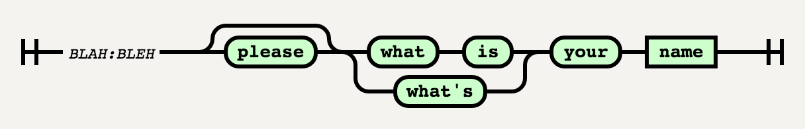

# Draw Diagram

Generate [Syntax Diagrams](https://en.wikipedia.org/wiki/Syntax_diagram) from simplified [BNF](https://en.wikipedia.org/wiki/Backus%E2%80%93Naur_Form) rules.

**Disclaimer**: this project is full of bugs!


## Rule format

Rules are composed of 3 parts, each separated by tabs (`\t`). They look something like this: `$LABEL\t$NAME\t$RULE`.

The first part and second are just used to identify the rule. Labels and names can be repeated, and they'll be merged together. Rules are the final part, and they also have their own format. Expected tokens are just regular words, but they can be made optional or part of a choice group. Optional tokens are enclosed in bracket (`[]`), and choices are inside parentheses (`()`) and with pipes (`|`) in between.

Words enclosed by less-than and greater-than signs (`<>`) will be drawn inside square boxes.

For example, a valid rule would be:

```
BLAH	BLEH	[please] (what is|whats) your <name>
```

This rule will generate the following diagram:



Combinations of modifiers can be used inside each other. For instance, a choice could be made optional with `[(a|b|c)]`.


## Installation

You need to generate the last version of the script used to interpret the rules. Once inside the project directory, you can do it by executing:

```bash
./sbt fastOptJS
```


## Run

After generating the required script (see previous section), just open `index.html`. There you can paste your rules and the appropriate diagrams will be generated and displayed on the page.


## Acknowledgments

This project wouldn't be possible without:

  * [railroad-diagrams](https://github.com/tabatkins/railroad-diagrams)
  * [Scala.js](https://www.scala-js.org/)
